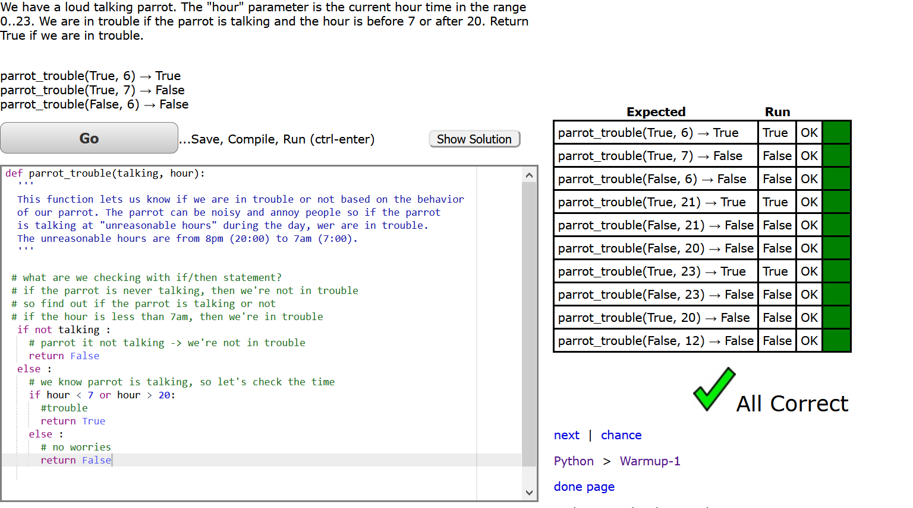
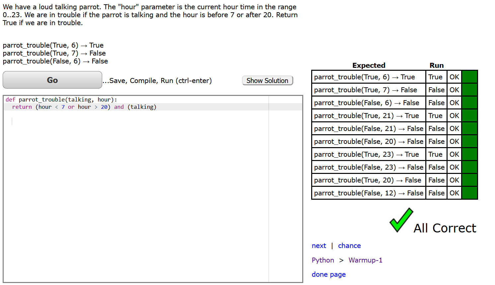
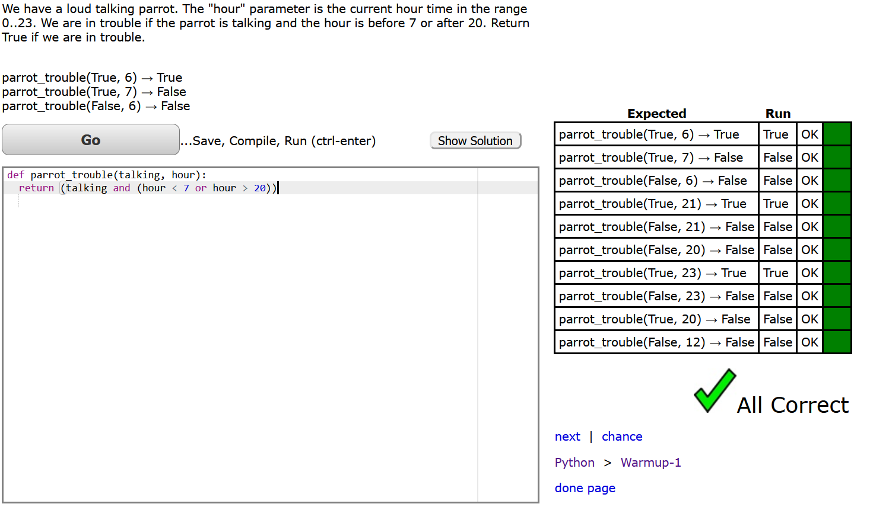
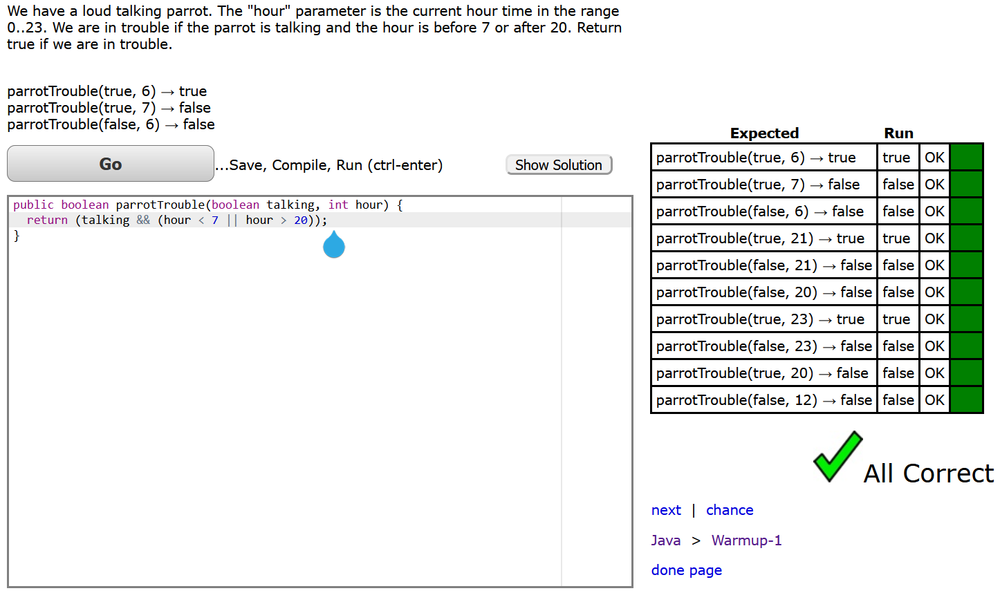

# Website
website using visual studio and python
1. Learn the basics of coding
2. Learn programming language most relevant to speech language pathology
3. Make an awesome website with language games
4. JavaScript and Data Structures Certification--Basic JavaScript (FreeCodeCamp?)
5. Scientific Computing with Python Certification


.png)

direct in git bash

.png)






## 02.19.2021 set up virtual environment venv
.png)
.png)
.png)
Codes are:
* which python
* python --version
* source ./venv/Scripts/activate
* which python
* pip install pylint pytest pytest-watch pytest-testmon pytest-describe
* pip freeze
* pip freeze > requirements.txt
* git add requirements.txt
* git status

* git commit -m"venv setup"
* git push

after writing the test
* pytest
* git add .
* git commit -m "sleep_in tests written"
* git push

## 02.22.2021 continue venv
* source ./venv/Scripts/activate #activate virtual environment
* pytest
* ptw #runs changes automatically
* = assignment == equality comparison

## 02.24/2021
* ctrl + / or control and forward slash marks every line highlited # or comments
* git status
```python
# pylint: disable=unused-variable
```
* makes yellow squiggly underline (means possible variable error) go away
* ```python
./venv/Scripts/activate
* ```
* M next to files means modified

## 02.26.2021
* 1. Finished monkey_trouble
* 2. Created JavaScript edition repository on github
* 3. Clone repository on git and code on visual studio
.png)
* 4. Initiated npm (==pip of Python)
    first check `which node` then `npm init`
    add description: My solutions to Coding Bat challenges in JavaScript
    add test command: jest
    add author: palletoon <palletoon@gmail.com>
* 3. Install lingting and testing tool
    ```js
    npm install eslint jest --save-dev
    ```
    eslint is for linting and jest is the testing --only required by developers and development dependencies. Never upload node_modules file onto github
* 4. Configure eslint
   ```js
   ./node_modules/.bin/eslint --help
   ./node_modules/.bin/eslint --init
   ```
the terminal will walk us through initializing eslint
.png)

## 03.01.2021
### 1. Configurated eslint and jest
```js
npm i -D eslint-plugin-jest # install
```
* in eslintrc.js, under env, under, es2021: true, add 
```js
'jest/globals': true,
```
and above rules: {
```js
plugins: ['jest'],
```

### 2. Finished sleepIn problem with js
* creat warmup-1\sleep_in then README.md and sleep_in.spec.js # which is equivalent of test
```js
npm test
```
* how to break up commit to keep commit history clean
*   git add ., git commit -m, git push
* misc: .eslintrc.js gets installed when you initialize eslint; 

Tips
* a. npm install == yarn add
* b. camel case (eslint uses this; e.g. sleepIn), snake case (e.g. sleep_in)
* == is checks value but not the data type. === is a strict equal sign that checks value & data type
* { = then
* watchmode for automatic test after save: 
```js
npm test -- --watch
```
* uses jsdoc to write

## 03.05.2021
### finished sumDouble problem in js
```js
const sumDouble = (x, y) => (x === y ? 2 : 1) * (x + y)
```

## 03.15.2021
### scope
* changing location/address or the value
* like print in python. find
```js
console.log(name)
```
* when you have a dictionary and a copy of a variable, they point to the same location in memory = changes to one, changes to both. applies ot js and python
```js
// give name1 value
let name1 = 5

// set name2 to the value of name1
let name2 = name1

// change name1
name1 = 10


console.log(name1, name2)
```
```js
let person1 = {
  first_name: 'Alice',
  last_name: 'Alison'
}

// set name2 to the value of name1
let person2 = person1

// change name1
person1.first_name = 'Nari'


console.log(person1.first_name, person2.first_name)
```
```js
// give name1 value
let person1 = {
  first_name: 'Alice',
  last_name: 'Alison'
}

// set name2 to the value of name1
let person2 = {...person1}

// change name1
person1.first_name = 'Nari'


console.log(person1.first_name, person2.first_name)
```
```js
let person2 = Object.assign({}, person1)
```
* python
```python
name1 = 'Nari'
name2 = name1
name1 = 'Alice'

print(name1, name2)
```
```python
person1 = {
  "first_name": "Alice",
  "last_name": "Alison"
}
person2 = person1


print(person1['first_name'], person2['first_name'])
```
```python
person2 = person1.copy()
```
* ctrl + d to select recurring text

